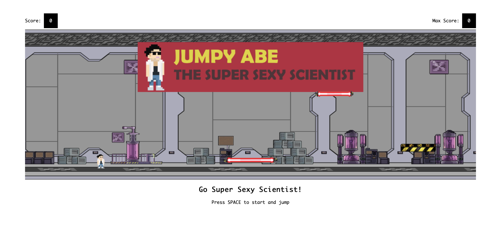

# jumpy-abe
By Sophia Oguri (tso24@cornell.edu), Luke Kratsios (lak245Cornell.edu), Isha Chirimar (idc26@cornell.edu), Jacob Hocking (jah643@cornell.edu) 

We developed an interactive game called Jumpy Abe, inspired by the [Super Sexy Science music video](https://www.youtube.com/watch?v=sy-kueG6KlA) by our graphics professor, Abe Davis. The goal of this game is to jump over and run on as many platforms as possible, while successfully avoiding the dangerous obstacles and not colliding with any of the platforms. We were inspired by [this](https://github.com/hehuilong/FlappyCube) Flappy Cube game implemented in Three.js, which structured our approach for this implementation. We implemented this game using Three.js/WebGL. It is a 2.5D game, with a WebGLRenderer, scene, rendered orthographic 3D camera, directional light, and meshes. 

 

## How to Play
1. Download all files
2. Open Terminal 
3. Run a server (i.e. python -m http.server 9080) 

## Game-Specific Features
Objective: Beat the highest score, recorded in the top right corner of the screen 

### Player movements that yield extra points 
- Running on top of a gold platform
- Hitting a gold platform from below

### Player movements that will not result in anything bad 
- Running on a gold platform or a safe ‘hazard’ platform 
- Hitting the bottom of a gold platform or safe ‘hazard’ platform
- Running on the ground 

### Player movements that will result in the player colliding with the platform and falling to the ground 
- Hitting the side of a gold platform or safe ‘hazard’ platform
- Hitting the corners of a gold platform or safe ‘hazard’ platform
- Hitting any part of the green ‘vat’ or the red laser beam, from the side, top, or below

### Platform Obstacles
- Platform widths and heights are generated randomly throughout the game and are updated randomly as the game progresses.
- Platforms are cycled as they reach the left-most side of the game screen, and are moved to the right-most side of the game screen, with randomly updated textures, qualities (safe, boost, dangerous), widths and heights. 
- Platform obstacles will increase in their speed and come faster towards the player as the game progresses.

### Music/Sound Effects
- Music from the Super Sexy Science video will be played as the player runs across the screen.
- Once the game is over, the music will stop.
- When the game restarts, the music will start off wherever it was paused at the end of the last run.
- When the player hits a gold platform or runs on a gold platform, “coin” sound effect will play. 
- When the player dies, a “death” sound effect will play.
